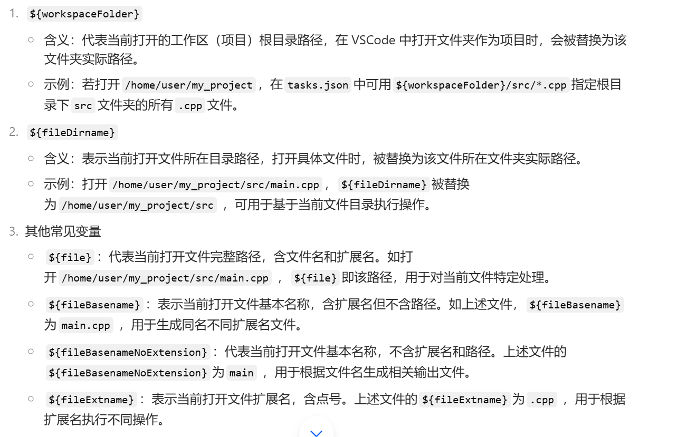

```
文章为原创，初次发表于知乎，发表时间为 2025-02-27
```

## ||———— 话说在前头 ————||
这篇文章解决的问题是和我一样在Windows上安装了WSL，并且在VSCode中用WSL环境编写C++程序，遇到的C++单文件和多文件编译的配置文件问题，并且重点在与多文件的配置文件书写。（多文件是指要用到头文件和多个源文件的cpp项目。）当然你如果是Windows环境也可以阅读。

如果你不知道什么是WSL，请上网自主搜索教程。

网上在这方面的经验贴较少，或者收费，或者是在windows环境下配置的，或者只停留在单文件的配置中。（当然或许写大型项目时用VS可能是一个更好的选择）

我为了解决多文件编译问题，连续5个小时在网上求助并在VSCode上尝试，前4个小时基本可以说是迷迷糊糊，不求甚解，直到最后直接询问AI配置文件中的每个属性的含义，才彻底弄懂了它的细节和代码运行过程。

所以这篇文章更侧重于解释tasks.json和launch.json中每个语句的含义和作用（所谓的“代码解析”），希望对你有所帮助

本文不保证所写代码为最高效代码，或许存在错误，单重在于让大家理解内部代码的含义！！

本文不保证所写代码为最高效代码，或许存在错误，单重在于让大家理解内部代码的含义！！

---

## ||———— 在理解配置文件之前 ————||
我们先理解一下你在VSCode上写的代码究竟经历了怎样的过程。

首先你写的cpp文件会被g++编译为可执行文件，这个过程在tasks.json中完成设置，然后系统再运行这些可执行文件，从main函数进入，中间会调用你在其他cpp文件中定义的函数。
理解好了这个过程，可以让你一定程度上理解配置文件之间的逻辑关系

---

## ||———— 单文件 Single File ————||
我先把自己的两个文件给放出来

这是**launch.json**

```json
{
    // Use IntelliSense to learn about possible attributes.
    // Hover to view descriptions of existing attributes.
    // For more information, visit: https://go.microsoft.com/fwlink/?linkid=830387
    "version": "0.2.0",
    "configurations": [
        {
            "name": "C/C++",
            "type": "cppdbg",
            "request": "launch",
            "program": "${fileDirname}/${fileBasenameNoExtension}",
            "args": [],
            "stopAtEntry": false,
            "cwd": "${workspaceFolder}",
            "environment": [],
            "externalConsole": false,
            "MIMode": "gdb",
            "preLaunchTask": "compile",
            "setupCommands": [
                {
                    "description": "Enable pretty-printing for gdb",
                    "text": "-enable-pretty-printing",
                    "ignoreFailures": true
                }
            ]
        }
    ]
}
```

这是**tasks.json**

```json
{
    "version": "2.0.0",
    "tasks": [{
            "label": "compile",
            "type":"shell",
            "command": "g++",
            "args": [
                "-g",
                "${file}",
                "-o",
                "${fileDirname}/${fileBasenameNoExtension}"
            ],
            "problemMatcher": {
                "owner": "cpp",
                "fileLocation": [
                    "relative",
                    "${workspaceRoot}"
                ],
                "pattern": {
                    "regexp": "^(.*):(\\d+):(\\d+):\\s+(warning|error):\\s+(.*)$",
                    "file": 1,
                    "line": 2,
                    "column": 3,
                    "severity": 4,
                    "message": 5
                }
            },
            "group": {
                "kind": "build",
                "isDefault": true
            }
        }
    ]
}
```

单文件还是比较好理解的

我们从tasks.json开始讲起

> label 这个翻译为标签，但是我觉得把它理解为一种“接口”更通顺。

为什么这样想？

我们注意到**tasks.json**文件中的`"label"`和**launch.json**的`"preLaunchTask"`是互相对应的。

其实这两个文件的对应部分必须相同，否则会报错。我们从“prelaunch”这个单词来理解，**“预处理”（应该是大意）,也就是说运行launch之前会先运行“label”为“compile”的task**，如果仔细看的话会发现task中就包含“编译成可执行文件”这个操作（稍后讲到）。这揭示了代码运行时的一些先后过程。

我们甚至可以提前拓展一下：

- tasks.json可以编写好几个task，只是它们的label不同
- launch中也有好几种configulation，只是name不同
- 只要launch中某种configulation能够和某个task对应上，他就可以执行代码

```
preLaunchTask "ABC"---->  label 为 "ABC" 的task
```

而这种对应就靠 label 来对接。

所以写cpp时有一种task，写python时又要补充其他的task。

在**tasks.json**中，有个属性是`"type"`

> type 表示任务的执行类型，cppbuild表示专门用于构建C++任务类型，shell则可以构建多个语言任务，如果你的文件中还有py文件等，用shell更合适

这个要和launch中的 type 区分一下，它表示调试器的类型，对C++用cppdbg(基于GDB或LLDB)，对Python用python，对Node.js用node.

> command 翻译为命令，可以理解为执行该task的主体。

意思是让g++来执行编译任务，这里应该是g++的文件路径

```json
    "args": [
        "-g",
        "${file}",
        "-o",
        "${fileDirname}/${fileBasenameNoExtension}"
    ],
```

接下来是重点，很多报错的问题其实就出现在args这个属性的书写上

> args 用来传递给 command 的参数，这下面的 -g，-o揭示代码运行时的先后过程

> -g 表示编译，下一行表示编译的对象的位置，它将编译的文件转化为可执行文件

> -o 表示输出（outcome），下一行表示表示可执行文件的输出位置及命名

这里我们对应到**launch.json**文件

```json
    "program": "${fileDirname}/${fileBasenameNoExtension}"
```

这个program属性其实就是到时电脑会执行的文件，如果你看过别人的VSCode，应该可以看到会多出几个没有后缀的文件，这些就是可执行文件。

所以我们回到最开始说的代码运行的过程

> 首先你写的cpp文件会被g++编译为可执行文件，这个过程在tasks.json中完成设置，然后系统再运行这些可执行文件，从main函数进入，中间会调用你在其他cpp文件中定义的函数。

tasks会生成对应可执行文件，launch会去寻找这个文件，然后运行。

#### 所以我们只要确保这个可执行文件名字在两个json文件中相同，就能够正确调试代码。这也是很多人遇到的报错原因："XXX" file doesn't exist!!

那么我们来进一步理解这些诸如filename之类的变量的含义。



这里还要解释下cwd（current working directory）的作用，相当于是给所有路径加了个起点，如果设置为${workspaceFolder}，那么-g, -o任务默认从这个根目录开始，这样它们下面你可以省略写${workspaceFolder}

我们再看这段代码

```json
    "args": [
        "-g",
        "${file}",
        "-o",
        "${fileDirname}/${fileBasenameNoExtension}"
    ],
```

g++对`${file}`编译，生成可执行文件并输出到` ${fileDirname} `，名为` ${fileBasenameNoExtension} `，然后launch中的任务回去寻找在` ${filenDirname} `下的` ${fileBasenameNoExtension} `,然后运行，显示在终端(**Terminal**)。

理解了这个，后面的多文件编译也就好理解了。

继续其他属性的解释

> problemMatcher 字面意思，用来提供报错信息的

> owner 表示所属的语言类型，这是就是C++

> fileLocation 表示报错时文件路基的定位方式，下面两行表示相对于工作区目录

> pattern 这里我也不太看懂，总之就是它会获取问题信息的各种关键信息，从下面的file, line等等就能理解

> group 分组，就像浏览器给标签页分组一样

然后我们看看launch.json中其他的属性

> request 它分为launch和attach两种，前者表示你调试时从头开始，后者可以让你在运行过程中调试，一般都选择launch

> args 这里设为空因为我们写的小程序不需要传什么参数，当需要时可以补充

> stopAtEntry 相当于在第一行设置断点，设置为true的话可以从第一行开始调试

> environment 暂且不讲

> MIMode 表示机器接口，用来将调试器和被调试程序进行通信的协议

> externalConsole 外部控制台，如果你喜欢那种弹出命令窗的样子的话，可以设置为true，但它可能运行完就自动关闭，最好pause一下

> setCommands 设置一些命令，description相当于注释，text是指令，ignoreFailures表示命令执行失败也继续调试 （所以这个pretty-printing漂亮打印是什么东西☺）


现在你已经看懂了配置文件的大部分属性了，相信你已经对这些属性的对应含义有了一定印象。

那我就再重复一遍前面那段话

> 首先你写的cpp文件会被g++编译为可执行文件，这个过程在tasks.json中完成，然后再运行这些可执行文件，从main函数进入，中间会调用你在其他cpp文件中定义的函数。

带着你的理解进入到多文件的编译吧。

---

## ||————多文件 Mutiple File ————||

这是**launch.json**

```json
{
    "version": "0.2.0",
    "configurations": [
        {
            "name": "g++ - Build and debug file",
            "type": "cppdbg",
            "request": "launch",
            "program": "${fileDirname}/${fileBasenameNoExtension}",
            "args": [],
            "stopAtEntry": false,
            "cwd": "${workspaceFolder}",
            "environment": [],
            "externalConsole": false,
            "MIMode": "gdb",
            "miDebuggerPath": "/usr/bin/gdb",
            "setupCommands": [
                {
                    "description": "Enable pretty-printing for gdb",
                    "text": "-enable-pretty-printing",
                    "ignoreFailures": true
                }
            ],
            "preLaunchTask": "C/C++: g++ build active file"
        }
    ]
}
```

这是**tasks.json**

```json
{
    "version": "2.0.0",
    "tasks": [
        {
            "label": "build",
            "type": "shell",
            "command": "/usr/bin/g++",
            "args": [
                "-g",
                "${fileDirname}/*.cpp",
                "-o",
                "${fileDirname}/${fileBasenameNoExtension}",
                "-I",
                "${fileDirname}"
                
            ],
            "group": {
                "kind": "build",
                "isDefault": true
            },
            "problemMatcher": [
                "$gcc"
            ],
            "options": {
                "cwd": "${workspaceFolder}"
            },
            "detail": "Task generated by debugger"
        }
    ]
}
```

多文件配置其实很多配置的地方和单文件相同，只是在taks.json中的 args 属性改下细节

先贴下我的文件结构图

```
MUTIPLE_FILE
|
|--.vscode
|   |--launch.json
|   |--tasks.json
|
|--ITEM01
|   |--item01.cpp
|   |--item01.h
|   |--test01.cpp
|
|--ITEM01
    |--item02.cpp
    |--item02.h
    |--test02.cpp

```

首先明确 `${workspaceFolder}` 是最上方那个的 `MULTIPLE_FILE`

ITEM01和ITEM02是两个项目文件。

我们希望VSCode好用，以后每次新建一个项目时就在`MULTIPLE_FILE`目录下新建一个文件夹，（**全部用英文！！**），这是好的文件管理习惯之一。

按照我们想的，以ITEM01项目为例，我们希望里面的cpp文件都能识别到自定义的源文件（item01.h），但如果你将单文件的配置文件复制粘贴的话，会发现它会报错，也就是识别不了。

我们看看下面这段代码

```json
"args": [
                "-g",
                "${fileDirname}/*.cpp",
                "-o",
                "${fileDirname}/${fileBasenameNoExtension}",
                "-I",
                "${fileDirname}"
                
            ],
```

正确的过程应该是，编译器要将ITEM01项目下的所有cpp文件都编译一遍，而前提是它要识别到源文件。上面的代码就实现了该目标

> `${fileDirname}/*.cpp` 表示扫描并编译`${fileDiename}`下面的所有cpp文件(*.cpp)

> -I 意思就是识别源文件，下面一行就是搜索路径

`${fileDirname}/`在这个例子中就是**ITEM01**（因为你运行的是含有main函数的cpp文件，要往上找到文件目录）

如此就能够正确运行了，生成的不带后缀名的文件就是可执行文件

当然，你要是在文件管理上有自己的习惯，比如所有的源文件都放在src文件夹，所以的头文件都放在include文件夹，你可以修改args下面的对应路径。

#### 至此，你已经理解了最重要的两个配置文件中代码的底层含义。

#### 你 应当 具备了自己调试环境的能力。

## ||—————————— 仅仅WSL？？ ——————————||

### 关于windows下的配置文件

其实底层原理都一样，在linux下，文件路径用` / `表示下一级目录，在Windows中却是用 `\\` （其实第一个`\`表示转义符号）

### 关于我的代码

首先我的代码一定不是最完美的，我写这篇文章的目的也不是给你们提供所谓正确的代码，而是让你们理解那些代码的具体含义，代码运行时究竟进行了一个怎样的过程，如果你认为我的代码有错，你自己修改就行。

## ||———— 一点思考：文章背后的故事 —————||

就像我在开头所说，为了完成WSL下C++多文件编译时的配置文件，我花了连续5个小时去研究，在网上找了各种经验贴，但前面4h基本没有收获，直到最后一小时才终于想通了问题的关键。

或许5h不算很长的时间，那是因为我没告诉你为了成功配置VSCode环境，我在这之前已经卸载了4遍VSCode，之前在Windows环境下尝试了3遍全部失败，（第4次虽然一定程度上成功但是使用体验很不爽，）一次又一次失败后，我在交大ACM班网页找到一篇环境配置指南（点名表扬交大）

[程序设计环境配置](https://acm.sjtu.edu.cn/wiki/%E7%A8%8B%E5%BA%8F%E8%AE%BE%E8%AE%A1%E7%8E%AF%E5%A2%83%E9%85%8D%E7%BD%AE)

于是在第五次下载时，我决定切换到WSL环境，这个过程也没那么顺利，如果算上我在寒假安装Ubuntu的时间，在WSL成功调试一个hello，world文件时我又花了几个小时，用了几天后，当我写多个源文件时，又出现了问题，于是就有了5h的寻助，调试。

其实现在看来，会觉得我的行为非常可笑。原来配置文件中的代码的含义这么简单，为什么我会反复尝试还无法成功？的确，在我最后一小时忽然想通后，我直接去问AI这些代码的含义是什么，看到解释的一刻我之前所有的疑惑瞬间被解开。

这样看来，我很“笨”，要是一开始就去询问AI这些语句的含义，或许我早就自己看懂了代码，或许我也不需要花那4h去找各种所谓指南、经验，毕竟花了几个小时去配置一个环境，多多少少让人感到羞耻（尽管再加上一点无用的自豪）。

但现实是，我在各种经验帖中兜兜转转，迷失了自我，愣是找不到出路。

所以，问题的真正关键在于：

**不是所有人一开始都会去想着学习这些代码的底层含义，更多的人只是在网上随便搜一篇经验贴，然后将代码复制粘贴，等到运行时出现错误时，又回过头去搜其他的经验贴，换一个版本，如此往复。而我，一开始也是如此。**

**在这个过程中，大概率反反复复调试不成功，于是刚开始接触编程的beginner早早选择放弃，亦或者有人在发现网上经验甚少时，选择了求助周围的人，从大佬或是师友那得到一份成功的“模版”。**

**可是无论是那种，这些人中的大部分，却很少 正眼 看看这些代码，他们一开始就被这看不懂的字母排列所恐吓，觉得密密麻麻的代码太复杂了，觉得网上直接找一段现成的更省时间吧。**

所以，真的省时间了吗？

**“知其然”真的就比“知其所以然”更快吗？**

网上铺天盖地的VSCode环境配置教程，绝大部分都告诉你，这段代码应该这样写；

而去寻找着教程的编程小白，绝大部分只要看到自己的代码能跑即可。

**一个卖鱼，一个买鱼。所以，谁需要钓鱼？**

---

**这篇文章的内容很简单，简单到熟练的程序员甚至懒得写一篇教程去解释；**

**这篇文章的内容很困难，困难得让粘贴我代码的不假思索者苦苦搞不懂报错原因。**

---

当然，现在想想我之前的经历，要是我一开始就向老师或者大佬求助，或许我早就完成了环境的配置，不必花如此大的时间代价，这未尝不是一条不错的出路；

但又细想，如果我一开始就求助，或许我现在不可能对这些语句有深刻的理解，也不可能有这篇长长的文章分享，更不会有这些激进的感想。**而写下这篇文章又花去我三个多小时。**

或许，只有我这种傻瓜才会傻傻地花时间研究，花时间总结，然后花时间感慨一番吧。

或许，时间本就没有什么意义，只是我投入的多了，我不甘心它被认为是“没有意义的吧”。

---

这是我配置WSL下VSCode的C++环境的经验总结，当我写下这篇长文时，它既不能给我增加学分，也不能提高我的编程能力，但我写下它，只是希望“后置来者，亦将有感于斯文”,当他被阅读后，知识的价值便不断被传递。

感谢大家阅读！！